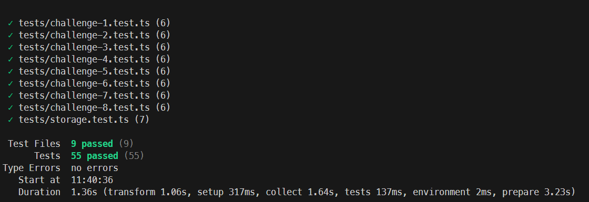
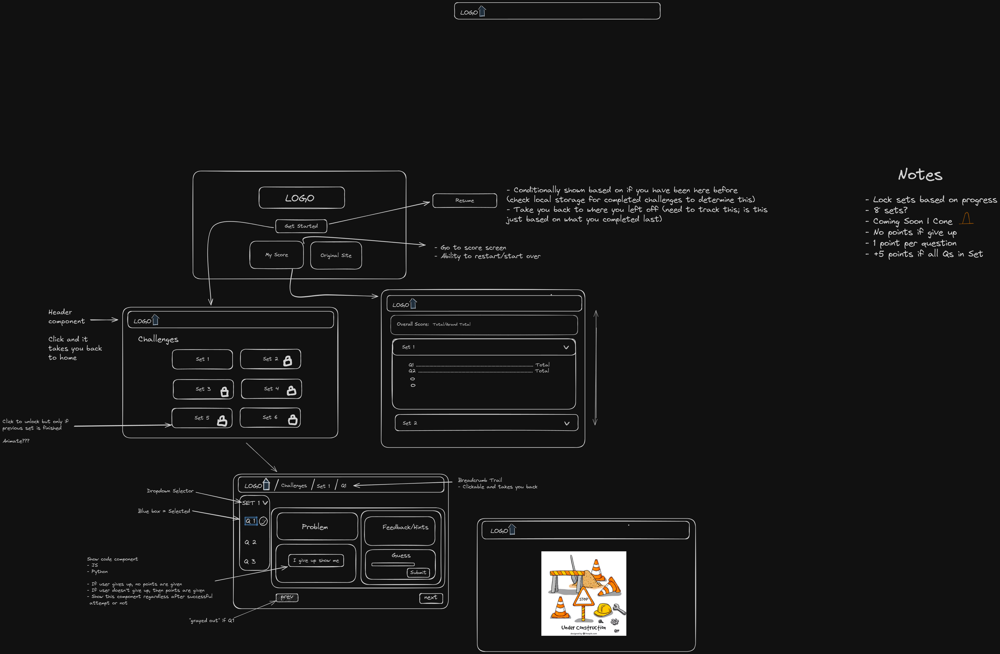

# Cryptopals Crypto Challenges

USM course - CSC 514 Software Engineering

## Overview
See it live! - [Website](https://cryptopals-sigma.vercel.app/)

Technologies used in and for the project:

- [T3 Stack](https://create.t3.gg) -- Bootstrap tool for production ready NextJS apps
- [Next.js](https://nextjs.org) -- Production ready framework built on top of React
- [Tailwind](https://tailwindcss.com) -- CSS utilities used for styling.
- [shadcn/ui](https://ui.shadcn.com/) -- Styling, components, and more. Built using Tailwind for styles.
- [git](https://git-scm.com/) -- Version control.
- [node](https://nodejs.org/en) -- JavaScript runtime.
- [pnpm](https://pnpm.io/) -- Package manager for node.
- [Vite](https://vite.dev/) -- Build tooling for Vite based projects.
- [Vitest](https://vitest.dev/) -- Testing framework for Vite.
- [coolors](https://coolors.co/002439-005066-4e7988-78cce2-e4eff0) -- Our color palette.
- [Excalidraw](https://excalidraw.com/) -- Wireframe and collaboration tool for diagraming.

## Project Description

A software suite to solve the [cryptopals crypto challenges](https://cryptopals.com/) and provide a easy to use web user interface for users to navigate, view, and solve challenges. The software is a prototype that only focuses on the 8 challenges within Set 1 and provides a test suite written using Vitest to ensure all algorithms function correctly.

## Setup

To run the project locally:

- Ensure you have [node](https://nodejs.org/en) installed on your system. Either via a node package manager ([nvm](https://github.com/nvm-sh/nvm), [fnm](https://github.com/Schniz/fnm), [nvs](https://github.com/jasongin/nvs)) or directly installed on the machine (not recommended). Please ensure the correct node version is installed by checking the `.nvmrc` in the project root.
- Install [pnpm](https://pnpm.io/), if not already.
- Clone the repository
- Navigate to the project root
    - `cd cryptopals`
- Install the dependencues
    - `pnpm i` OR `pnpm install`
- Run the project locally
    - `pnpm dev`

That's it! 

Other useful scripts can be found in the `packge.json` file and be ran by prefixing the script name with `pnpm` such as:
- `pnpm build`: Create a bundled build output for the project.
- `pnpm test`: Run all tests and start the Vitest listener.

## Testing Information

This project uses [Vitest](https://vitest.dev/) as the test runner.

To run the the tests:
- `pnpm test`

This will run through all the 8 challenge tests as well as our storage utilities test. 

See the below screenshot of our results:

## Mockups

These are our initial mockups and ideas of how the website would flow and look:

